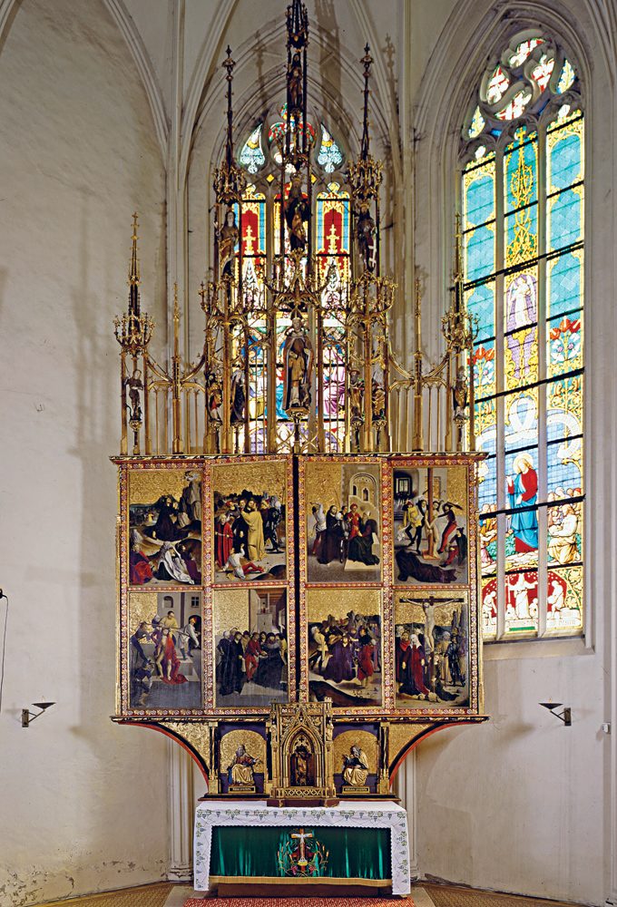
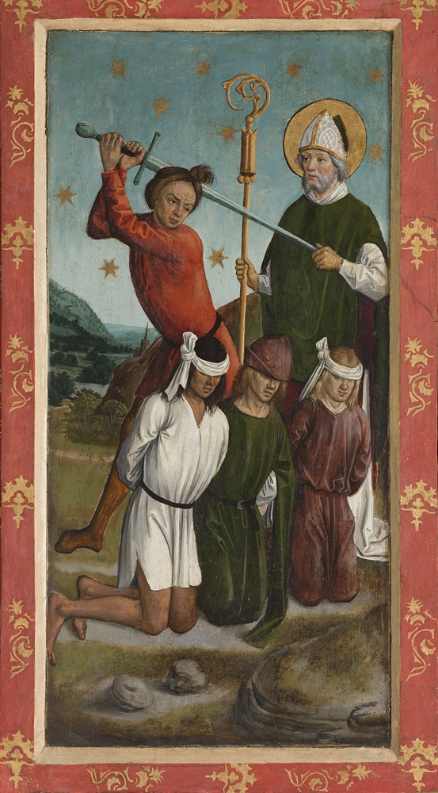
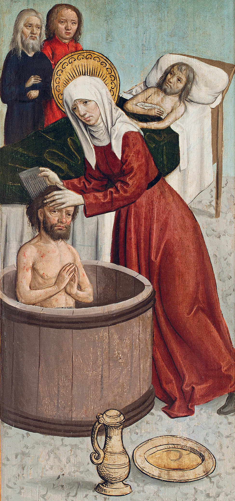
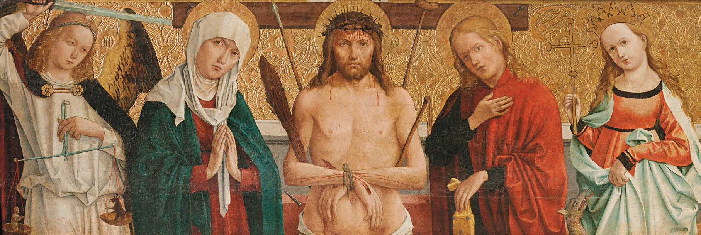

## Majster

    Umelecká identita anonymného Majstra z Okoličného je pre verejnosť v podstate neznáma. Je "núdzovo" pomenovaný podľa svojho najvýznamnejšieho diela - Hlavného oltára kláštorného kostola františkánov-observantov v Okoličnom. Majster z Okoličného bol súčasníkom – a kolegom – Majstra Pavla z Levoče, dá sa mu pripísať rad výnimočných obrazov, a predsa takmer upadol do zabudnutia. Kvalitou svojej tvorby však prevyšoval štandard špišského maliarstva okolo roku 1500, čím ho zároveň spoluvytváral.

    

        Jeho jednotlivé obrazy sú rozptýlené po rôznych zbierkach doma aj v zahraničí, niektoré chýbajú úplne. Záujem špecialistov o Majstra z Okoličného akceleroval po roku 1989, v čase otvorenia hraníc, vrátane hraníc humanitných vied. Postupne boli zreštaurované viaceré jeho oltárne práce a Majster z Okoličného sa stal pevnou súčasťou nateraz len imaginárneho korpusu gotického tabuľového maliarstva Slovenska.
    

    

        Reštaurovanie:  
         - Oltár Korunovania Panny Márie v Spišskej Kapitule: 1976 – 1977, dokumentácia v 1997 
         - Triptych sv. Anny zo Smrečian: 2009 
         - Ukrižovanie z okoličnianskeho oltára, Slovenská národná galéria: 2010 
         - Oltár Panny Márie a sv. Erazma v Bardejove: 2013 – 2014 
         - Oltár Navštívenia Panny Márie v Košiciach: 2010 – 2013, dva tabuľové obrazy z tamojšieho Východoslovenského múzea, 2013 
         - Druhý triptych zo Smrečian zasvätený sv. Martinovi a sv. Mikulášovi: 2017 
    

    

        Pojem „Majster z Okoličného“ skôr než konkrétneho umelca označuje dielenskú jednotku, ktorá zahŕňala viacero stolárov, sochárov, maliarov či pozlacovačov. Tak ako v prípade iných maliarov a sochárov okolo roku 1500 v strednej Európe, Majster z Okoličného neváhal zostavu svojej dielne ad hoc prispôsobovať rozsahu objednávky a podobným spôsobom zrejme aj sám prijímal členstvo v iných dielňach. V konjunktúre, ktorú približne medzi rokmi 1480 – 1520 zaznamenalo oltárne umenie na Spiši, nebola núdza ani o objednávky, ani o peniaze, a tiež o narastajúcu konkurenciu. V tomto umelecky plodnom, ale faktograficky neistom období je zrejme najspoľahlivejším identifikačným znakom samotný výtvarný štýl, o ktorého zmapovanie sa výstava pokúša.
    

    

        Kolektívny charakter tvorby neskorogotických oltárov je v protiklade s tendenciou moderného dejepisu umenia čo najpresnejšie identifikovať konkrétneho autora (renesančný mýtus „umeleckého génia“).
          
        Množstvo nesúrodých fenoménov je tak neraz pripisovaných jednému autorovi alebo imaginárnemu „hlavnému majstrovi dielne xyz“. Prominentnou obeťou tejto tendencie je v spišskom umení už tradične Majster Pavol z Levoče.
    

---
## Pôvod

    Základné atribúty štýlu Majstra z Okoličného sa prvý krát objavujú na Oltári Korunovania v Spišskej Kapitule. Toto najdôležitejšie cirkevné centrum na Spiši prešlo počas druhej polovice 15. storočia rozsiahlou prestavbou a získalo novú a omnoho honosnejšiu výzdobu - sochy, mobiliár v dreve i textile a najmä nové oltáre s výzdobou, do ktorej už rázne prenikali progresívne prvky nizozemského maliarstva. Pri tejto príležitosti sa mohla sformovať dielňa – možno ad hoc zorganizovaná skupina maliarov (medzi nimi aj Majster z Okoličného) – ktorú svojou oltárnou objednávkou poveril palatín Štefan Zápoľský.

    

    

    

        Zrejme nešlo o dlhodobo pôsobiaci ateliér, jednotlivých maliarov tohto kolektívu čoskoro nachádzame pracovať samostatne: vedľa Majstra z Okoličného k nim patril Majster z Hrabušíc, pravdepodobne aj Majster Oltára sv. Antona v Spišskej Sobote – neskôr jeden z najprogresívnejších maliarov na Spiši – ako aj hlavný majster tamojšieho Oltára sv. Anny. Rad ďalších umelcov mohol s ateliérom kapitulského oltára spolupracovať a neskôr – v závislosti od množstva ďalších objednávok – migrovať medzi dielňami spomenutých popredných osobností spišského maliarstva po roku 1500.
    

Štýl Majstra z Okoličného rozoznávame čoskoro aj na iných oltároch a obrazoch, a to v relatívne veľkom geografickom rozpätí. Oltár Panny Márie, sv. Mikuláša a sv. Erazma vo farskom kostole sv. Egídia v Bardejove, na ktorom ešte spolupracoval s Majstrom z Hrabušíc, patrí medzi prvé práce s charakteristickými znakmi, neskôr rozvinutými aj v Okoličnom - redukcia plochy pozláteným brokátovaním, maliarsky prepracované postavy a tváre s koncentrovanejšími pohľadmi a starostlivo modelovanými svetlými inkarnátmi. Spolu s ďalšími maliarmi sa Majster z Okoličného podieľal aj na oltárnych triptychoch pre zemepanský kostol v Smrečanoch (1510 – Oltár Svätého príbuzenstva a Oltár sv. Mikuláša a sv. Martina), kde možno rozoznať podobnú prácu s inkarnátmi.

Oltárne retabulum v Okoličnom (vytvorené v rozmedzí rokov cca 1500 – 1510) pre nášho maliara zrejme predstavovalo prvú naozaj samostatnú objednávku, kvôli ktorej sa ale musel obklopiť viacerými spolupracovníkmi z iných remeselných oblastí. Koordinátorom jednotlivých prác a fáz výzdoby v Okoličnom bol zrejme Majster Pavol z Levoče, ktorý v tom čase dokončoval minimálne dva ďalšie veľké oltáre v Levoči a Banskej Bystrici a disponoval veľkým množstvom pomocníkov.

Po roku 1510 na nejaký čas stopa po maliarovi zmizla. Možno spolupracoval na menších objednávkach, možno sa len nezachovali práve tie oltáre, ktoré jeho dielňa vytvorila. Spoľahlivo sa objavil znova až v roku 1516, keď datoval jeden z najkrajších oltárov Dómu sv. Alžbety – Oltár Navštívenia Panny Márie, ktorý prekvapí svojou pestrosťou a farebnými kontrastmi. Dielňa Majstra z Okoličného sa tu javí už ako pomerne mobilný ateliér, pracujúci tak pre cirkevných ako aj svetských objednávateľov. Majster využíval výhody relatívne bohatého trhu [4] s objednávkami bez ohľadu na to, či pochádzali od magnátskeho rodu (Zápoľskí), kláštornej komunity (františkáni-observanti) alebo od mestských elít (Michal Günthert v Košiciach). V prostredí Košíc sa Majster na sklonku svojej kariéry usídlil na dlhšie a zjavne ešte stihol vyškoliť niekoľko kvalitných nasledovníkov (Monogramista L.A.).

Aj pri predpokladanej strate veľkého množstva oltárov, nehovoriac o svetských obrazoch, predsa len je zvláštne, že Majster z Okoličného sa so svojou dielňou (dielňami?) na scéne preukázateľne udržal len čosi cez desať rokov. Podobne ako u iných umelcov na začiatku 16. storočia, aj u neho ostane záhadou, kam po poslednom datovanom diele z roku 1516 zmizol.

Či už na Spiši alebo v okolí Košíc, v Bardejove alebo v Prešove, prostredie bohatých východoslovenských miest ponúkalo dostatok príležitostí ešte minimálne jedno desaťročie. Hospodárska konjunktúra spišských miest a ich topografická aj geopolitická otvorenosť umožnili nárast počtu objednávok spektakulárnych oltárov a zamestnávanie čoraz väčšieho množstva umelcov. Umelecké dielne postupne zvyšovali svoju efektivitu a využívali drahšie technológie, zároveň sa však nebáli experimentovať s výberom a spracovaním námetov. Boli taktiež navzájom prepojené migráciou jednotlívých umelcov, prinášaním a spracovávaním nových podnetov zvonku, predovšetkým z oblasti nizozemského a nemeckého maliarstva a grafiky. Výtvory spišských sochárskych a maliarskych dielní čoskoro začali plniť kostoly tiež v Above, Šariši alebo na Liptove.

